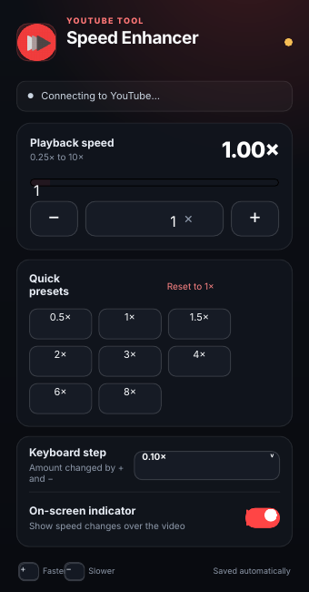
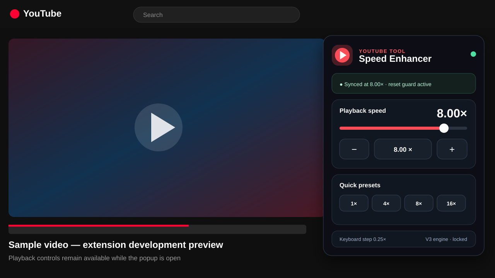

<div align="center">


# YouTube Video Speed Enhancer

### Precise YouTube playback control beyond the native speed menu

Set exact playback rates from **0.25× to 10×**, jump between presets, use keyboard controls, and keep your preferences synced across YouTube sessions.

[](https://github.com/Rishikeshsanin/youtube-video-speed-enhancer/actions/workflows/ci.yml)


**No account · No analytics · No remote scripts · No build step**

</div>

---

## Preview

<table>
<tr>
<td width="50%" align="center">
<strong>Popup UI</strong><br/><br/>

</td>
<td width="50%" align="center">
<strong>On YouTube</strong><br/><br/>

</td>
</tr>
</table>

> **Development status:** v2 is actively being hardened against YouTube player behavior across Chromium browsers. A known playback-rate mismatch is tracked in [Issue #1](https://github.com/Rishikeshsanin/youtube-video-speed-enhancer/issues/1).

## Why this project exists

YouTube's playback menu is useful for common speeds, but it is intentionally limited. This extension adds a dedicated control layer for people who want **finer increments, faster presets, persistent settings, and speeds beyond the native menu**.

The project started as a small keyboard-based controller and has since been rebuilt as a modern **Manifest V3** extension with a redesigned popup, Chrome storage, content-script messaging, SPA navigation handling, player replacement detection, and automated regression tests.

## Features

- **0.25×–10×** configurable playback range
- Exact speed slider + numeric input
- Quick presets: **0.5×, 1×, 1.5×, 2×, 3×, 4×, 6×, 8×**
- `+` / `−` keyboard speed control
- Configurable keyboard step: **0.10×, 0.25×, 0.50×, 1.00×**
- Persistent preferences via `chrome.storage.sync`
- YouTube SPA navigation support
- Replacement `<video>` detection
- Playback-rate reapplication guard
- Optional on-screen speed indicator
- Input-safe shortcuts that do not interfere while typing
- Connection/status feedback inside the popup
- Minimal permissions: **`storage` only**
- No telemetry, ads, external runtime dependencies, or remote code

## Install locally

### Chrome

1. Clone or download this repository.
2. Open `chrome://extensions`.
3. Enable **Developer mode**.
4. Click **Load unpacked**.
5. Select the folder containing `manifest.json`.
6. Open or refresh a YouTube tab.

### Brave / Edge

The same unpacked extension works through the Chromium extension system:

- Brave: `brave://extensions`
- Edge: `edge://extensions`

After changing source files, use the **Reload** button on the extension card and refresh the YouTube tab before retesting.

## Usage

| Goal | Control |
| --- | --- |
| Increase speed | `+` or popup `+` |
| Decrease speed | `−` or popup `−` |
| Set an exact speed | Slider / number input |
| Jump to a common value | Preset buttons |
| Return to normal speed | **Reset to 1×** |
| Change keyboard increment | **Keyboard step** dropdown |
| Hide/show visual feedback | **On-screen indicator** toggle |

## Architecture

```text
.
├── manifest.json
├── popup.html
├── popup.css
├── popup.js
├── youtube_speed_change.js
├── assets/
│   └── youtube_video_speed_icon.png
├── docs/
│   ├── ARCHITECTURE.md
│   └── screenshots/
│       ├── popup-v2.png
│       └── youtube-live-preview.svg
├── tests/
│   ├── static-checks.py
│   └── content-script.test.cjs
├── .github/
│   ├── ISSUE_TEMPLATE/
│   └── workflows/ci.yml
├── CHANGELOG.md
├── ROADMAP.md
├── CONTRIBUTING.md
├── SECURITY.md
├── PRIVACY.md
└── LICENSE
```

The popup and the YouTube content script communicate through Chrome extension messaging. User preferences are persisted with `chrome.storage.sync`. The content script observes player lifecycle/DOM changes and attempts to keep the selected playback rate applied when YouTube replaces or resets the active `<video>` element.

For the deeper design, see [docs/ARCHITECTURE.md](docs/ARCHITECTURE.md).

## Development

There is intentionally **no bundler and no runtime dependency tree**. The repository stays inspectable: what you read is what the browser runs.

Run the complete local check suite:

```bash
npm test
```

Or run each check directly:

```bash
node --check popup.js
node --check youtube_speed_change.js
python -m json.tool manifest.json > /dev/null
python tests/static-checks.py
node tests/content-script.test.cjs
```

CI runs the same checks for every push and pull request.

## Current engineering focus

The highest-priority work is making the **displayed requested speed and the effective YouTube player speed stay identical across Chrome, Edge, and Brave**, including cases where YouTube internally rewrites the playback rate. See the [roadmap](ROADMAP.md) and open [issues](https://github.com/Rishikeshsanin/youtube-video-speed-enhancer/issues).

## Privacy

The extension stores only its own user preferences. It does **not** collect or transmit browsing history, video information, personal data, analytics, or telemetry.

Read the complete policy in [PRIVACY.md](PRIVACY.md).

## Contributing

Bug reports from different YouTube layouts and Chromium browsers are especially useful. Please read [CONTRIBUTING.md](CONTRIBUTING.md) before opening a PR.

## License

Released under the [MIT License](LICENSE).

---

<div align="center">

Built and maintained by **Rishikesh Munnaluri**

</div>
