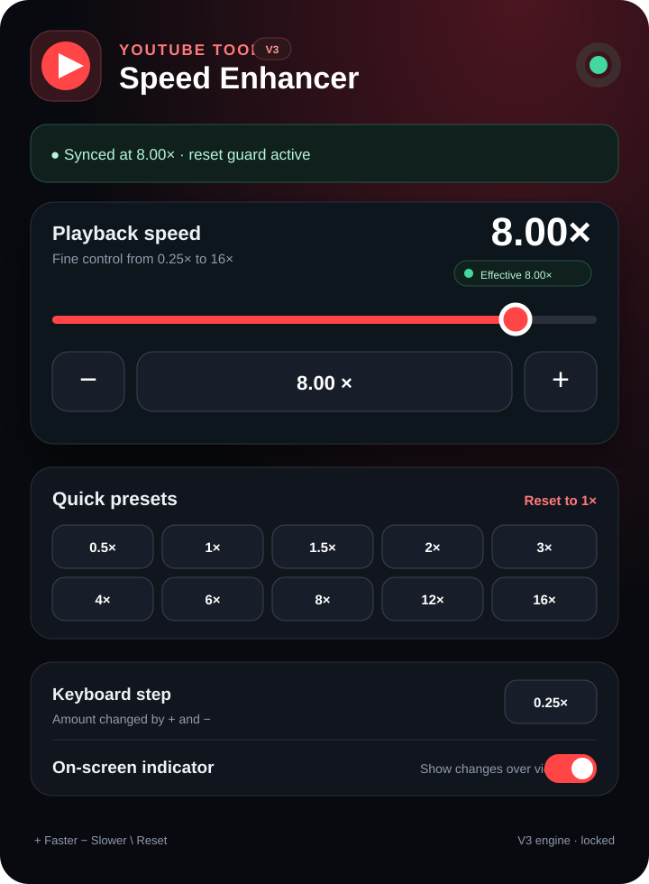

<div align="center">


# YouTube Video Speed Enhancer

### Reliable, precise playback control beyond YouTube's native speed menu

Set YouTube from **0.25× to 16×**, use quick presets and keyboard controls, and keep custom rates locked even when the page tries to reset the player.

[](https://github.com/Rishikeshsanin/youtube-video-speed-enhancer/actions/workflows/ci.yml)


**No account · No analytics · No remote scripts · No build framework · Minimal permissions**

</div>

---

## V3 at a glance

<table>
<tr>
<td width="44%" align="center">
<strong>V3 popup</strong><br/><br/>

</td>
<td width="56%">
<strong>What changed in V3</strong><br/><br/>

- MAIN-world player controller starts at <code>document_start</code>
- isolated extension bridge keeps <code>chrome.*</code> APIs separated from page code
- custom rates are guarded against YouTube-side resets
- native YouTube rates are synchronized through the player API when available
- requested and effective playback rates are shown separately
- automatic recovery covers SPA navigation and replacement video elements
- speed range increased to <strong>16×</strong>
- release ZIPs are reproducible from the repository

</td>
</tr>
</table>

<p align="center">
  
</p>

> **Release status:** `3.0.0 RC1` is a major reliability rewrite. Automated engine/bridge tests pass, but the release remains an RC until it is manually verified on current production YouTube in both Brave and Chrome.

## Why the old implementation could say 10× while the video stayed slow

V2 wrote directly to the page's `<video>.playbackRate` from an isolated content script. That changes the real HTML media element, but YouTube also maintains its own player state and can write a native rate back afterward. The old test harness only simulated a DOM video element, so it could pass while missing the production player-state race.

V3 changes the architecture instead of adding another timer:

```text
Popup
  │ chrome.tabs.sendMessage
  ▼
ISOLATED bridge (youtube_speed_change.js)
  │ settings / keyboard / storage / diagnostics
  │ DOM event + attribute protocol
  ▼
MAIN-world engine (player-main.js)
  │
  ├── YouTube player API for supported/native rates
  ├── native HTMLMediaElement setter for custom rates
  ├── MAIN-world playback setter guard for page resets
  ├── ratechange recovery
  ├── player replacement + SPA navigation recovery
  └── effective-rate telemetry
```

The MAIN-world engine is intentionally small and has **no access to extension APIs**. The isolated bridge owns storage and popup messaging.

## Features

- Playback range from **0.25× to 16×**
- Logarithmic slider for useful precision near normal speeds and fast access to high speeds
- Exact numeric input
- Presets for **0.5×, 1×, 1.5×, 2×, 3×, 4×, 6×, 8×, 12×, 16×**
- `+` / `−` speed controls
- `\` resets to **1×**
- Configurable keyboard step: **0.10×, 0.25×, 0.50×, 1.00×**
- Effective-rate telemetry in the popup
- Automatic hard-lock only when a requested rate is outside YouTube's available player-rate table
- YouTube SPA navigation support
- Replacement `<video>` detection
- `ratechange` recovery and lightweight watchdog fallback
- Persistent settings with `chrome.storage.sync`
- Optional on-screen speed indicator
- Input-safe shortcuts that do not fire while typing
- Chrome / Brave / Edge support on Chromium 111+
- Only one extension permission: **`storage`**
- No telemetry, ads, remote code, or runtime dependencies

## Install locally

### Chrome

1. Clone or download this repository.
2. Open `chrome://extensions`.
3. Enable **Developer mode**.
4. Click **Load unpacked**.
5. Select the repository root — the folder containing `manifest.json`.
6. Open or refresh a YouTube video.

### Brave / Edge

Use the same unpacked folder:

- Brave: `brave://extensions`
- Edge: `edge://extensions`

After source changes, click **Reload** on the extension card and then refresh the YouTube tab. Manifest and content-script changes require both steps.

## How to verify V3

Use a normal YouTube video and test these in order:

| Test | Expected result |
| --- | --- |
| `1× → 2×` | popup and actual player both show 2× |
| `2× → 4×` | player visibly accelerates and effective rate reports 4× |
| `4× → 8×` | effective rate remains 8× instead of falling back |
| `8× → 16×` | video runs at 16× if the browser/media pipeline supports it |
| navigate to another video without reload | chosen rate is reapplied |
| type in search/comments and press `+`/`−` | text input is unaffected |
| while at custom rate, let YouTube try to reset the player | V3 reports the reset guard and restores the target |

At very high rates, audio behavior can vary by browser/media pipeline even when video playback remains accelerated.

## Project structure

```text
.
├── manifest.json
├── player-main.js              # MAIN-world YouTube/media controller
├── youtube_speed_change.js     # ISOLATED bridge, storage, keyboard, popup messaging
├── popup.html
├── popup.css
├── popup.js
├── assets/
│   └── youtube_video_speed_icon.png
├── scripts/
│   └── build-release.py
├── tests/
│   ├── player-main.test.cjs
│   ├── content-script.test.cjs
│   └── static-checks.py
├── docs/
│   ├── ARCHITECTURE.md
│   └── screenshots/
├── .github/
│   ├── ISSUE_TEMPLATE/
│   ├── pull_request_template.md
│   └── workflows/ci.yml
├── CHANGELOG.md
├── ROADMAP.md
├── CONTRIBUTING.md
├── SECURITY.md
├── PRIVACY.md
└── LICENSE
```

## Development

There is no bundler and no application dependency tree. What is in the repository is what the browser executes.

Run the full validation suite:

```bash
npm test
```

The suite checks:

- JavaScript syntax
- Manifest V3 wiring
- MAIN/ISOLATED execution-world separation
- player API synchronization
- custom-rate setter interception
- recovery from a simulated YouTube rate reset
- replacement video handling
- storage synchronization
- keyboard behavior
- speed clamping
- repository/runtime packaging integrity

Build the installable release archive:

```bash
npm run package
```

The ZIP is generated under `dist/` with only browser-runtime files.

## Privacy and security

The extension stores only its own playback preferences. It does **not** collect browsing history, video titles, account information, analytics, or telemetry, and it performs no network requests of its own.

See [PRIVACY.md](PRIVACY.md) and [SECURITY.md](SECURITY.md).

## Roadmap

Reliability comes before extra features. Current priorities are tracked in [ROADMAP.md](ROADMAP.md) and GitHub Issues.

## Disclaimer

YouTube Video Speed Enhancer is an independent open-source project and is not affiliated with, endorsed by, or sponsored by YouTube or Google.

## License

Released under the [MIT License](LICENSE).

---

<div align="center">

Built and maintained by **Rishikesh Munnaluri**

</div>
